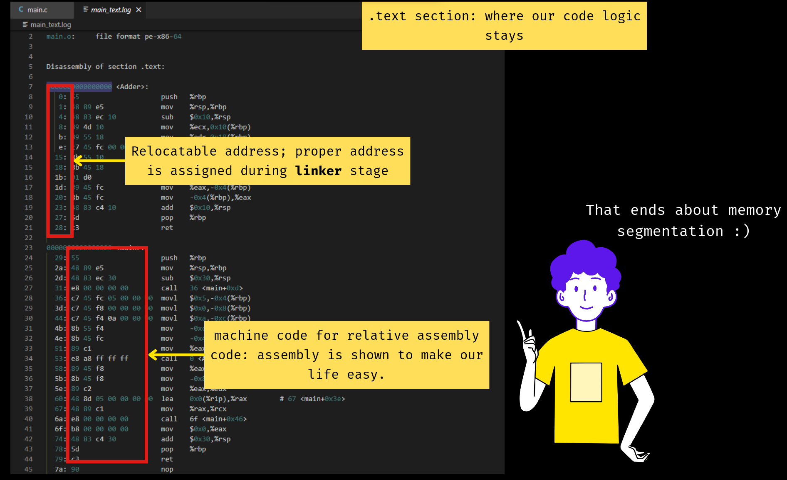

# Compilation: Object File Decoded

1.  “.bss” doesn’t consume space in flash, but “.data” does.
2.  “.bss” section size is recorded and is allocated in stack, recording of size is done by linker. <- we will learn about it, further.
3.  “static int Num1 = 5;” will be part of “.data” but “int Num1 = 5;” will be part of “.bss”. WHY? Static will be seen as global data - making “.data” section worthy, for, latter will be taken in “.bss” and considered when main() is called - making it “stack” worthy.

Note: A value in “.rdata” cannot be modified, if you try, it will segmentation fault.

