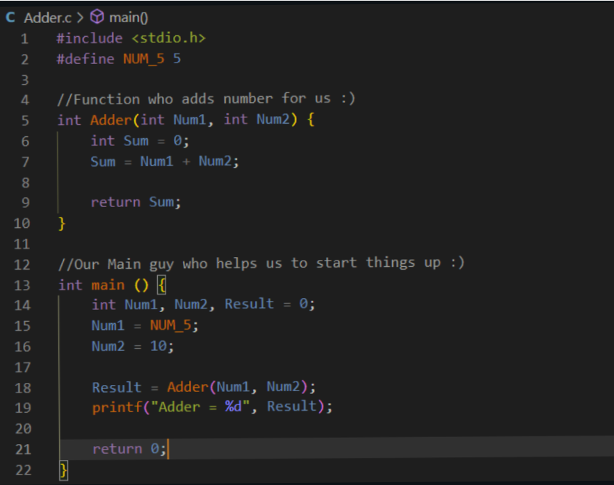
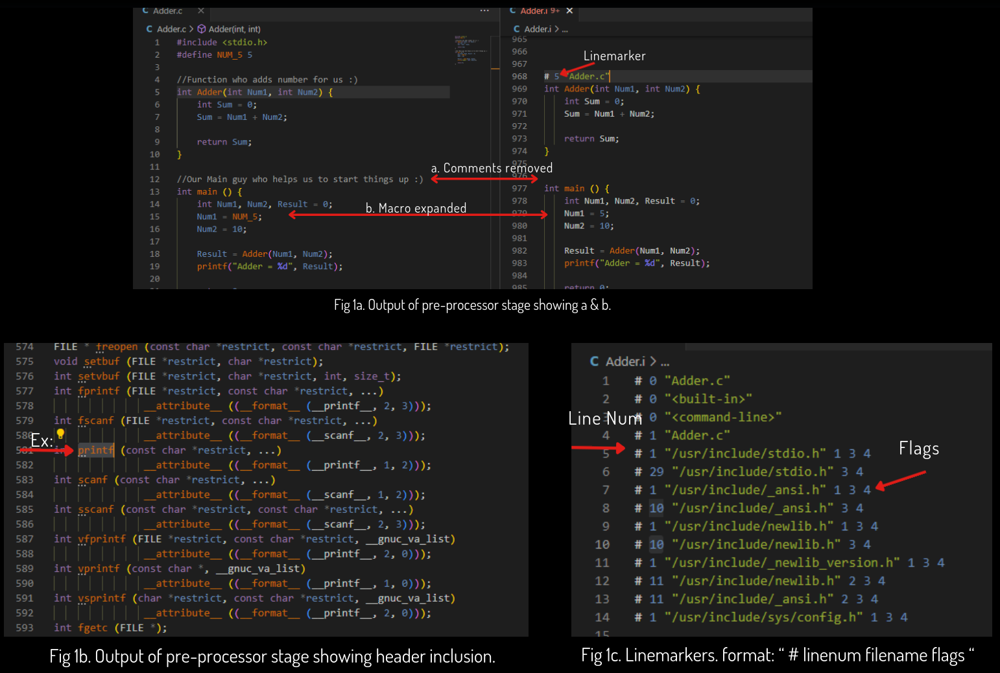
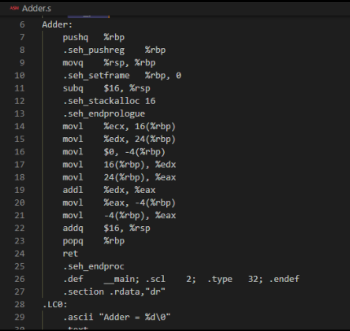
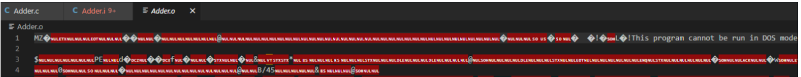
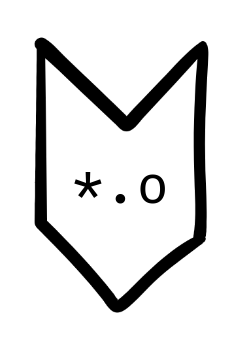

# Compilation: What is it? How it works?

## 01\. Editor: Source file

It is the code you write. It contains the logic, comments, macros, file-inclusions (Ex: &lt;stdio.h&gt;), conditional builds, etc. Following is an example:

&nbsp;            
## 02\. Pre-Processor

1.  It is invoked by the compiler(Ex: GCC) you are using to build the code.
2.  Output of pre-processor file:
    1.  Removes comments “//” or “/\*\* \*\*/”.
    2.  macro expansion and “#”
    3.  Header file inclusion: the entire content of the header is copied, replacing "#", basically contains function declarations and macros.
3.  Conditional compilation & diagnostics: “#error” inside conditions, resulting in fatal error.
4.  Uses “line-markers” to convey information. (See figures for better clarity.)

&nbsp;            
## 03\. Parsing: Checks structural mistakes.

Responsible for eliminating white-space and erroneous characters, checks if it is adhering to programming language’s grammar. AN AST (Abstract Syntax Tree) is output of this phase, additionally, it performs flow, type and label checks. If an error is found, the linemarkers help in showing the error-line.

&nbsp;            
## 04\. Compiler: Generates assembly code

High-level code is converted to processor-level mnemonics, i.e., assembly code. Assembly code is always machine-specific; the compiler takes note of the type of machine it is being used during installation. If you decide to have an assembly code of a different machine type, then you set flags accordingly for the compiler to know what to build for.

&nbsp;            
## 05\. Assembler: Generates Machine-code

Responsible for eliminating white-space and erroneous characters, checks if it is adhering to programming language’s grammar. An AST (Abstract Syntax Tree) is output of this phase, additionally, it performs flow, type and label checks. If an error is found, the linemarkers help in showing the error-line.

&nbsp;            
## 06\. Linker: links all files

Creates executable or binaries that you can run. Linker links (as name says) all the individual “*.obj” or “*.o” that were created during build process and made into one final, self-contained executable.

